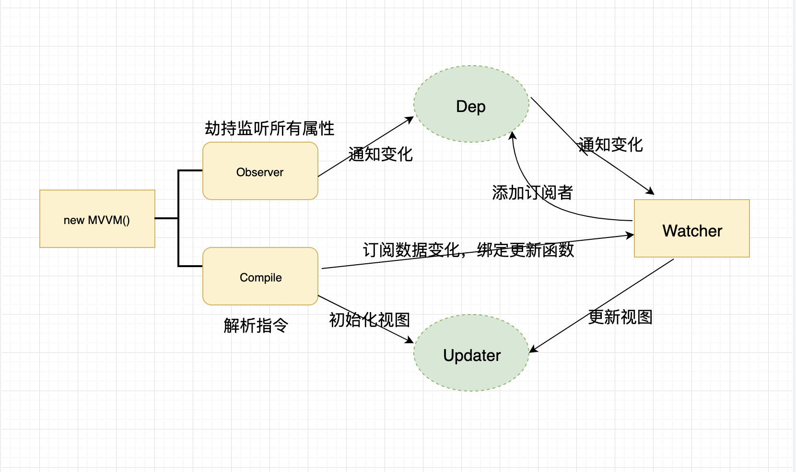

# MVVM解析

vue采用的是数据劫持结合发布者-订阅者模式，通过`Object.defineProperty()`来劫持各个属性的setter,getter,在数据变动时发布消息给订阅者，触发相应的监听回调

## Object.defineProperty
`Object.defineProperty`方法会直接在一个对象上定义一个新属性，或者修改一个对象的现有属性， 并返回这个对象，先来看一下它的语法：

``` js
Object.defineProperty(obj, prop, descriptor)
```

> `obj`是要在其上定义属性的对象  
>`prop`是要定义或修改的属性的名称  
>`descriptor`是将被定义或修改的属性描述符  

核心的是`descriptor`里面的get和set  
`get`是一个给属性提供的getter()方法，当我们访问了该属性的时候就会触发getter方法  
`set`是一个给属性提供的setter()方法，当我们对该属性做修改的时候会触发setter方法  

一旦对象拥有了getter和setter,我们就可以把这个对象称为响应式对象

## 简易版流程图



## Example
让我们看一个例子

``` html
<div id="app">
    <h2>{{person.name}} -- {{person.age}}</h2>
    <h3>{{person.fav}}</h3>
    <h2 v-text="msg"></h2>
    <h2 v-text="person.name"></h2>
    <h3 v-html="htmlStr"></h3>
    <h1>{{msg}}</h1>
    <input type="text" v-model="msg">
    <button v-on:click="handleClick">v-on:click</button>
    <button @click="handleClick">@click</button>
</div>
```

然后这里引入自己写的MVue.js 和 Observer.js

``` js
let vm = new MVue({
    el: '#app',
    data: {
        person: {
            name: '张三',
            age: 18,
            fav: 'film'
        },
        msg: 'mvvm内容',
        htmlStr: '<h1>这是v-html</h1>'
    },
    methods: {
        handleClick() {
            // this.$data.person.name = '哈喽'
            this.person.name = '哈喽'
        }
    }
})
```

接下来就是MVue.js的内容啦

``` js
//编译模版执行
const complierUtil = {
    //处理person.name这种对象类型,取出真正的value
    getValue(expr, vm) {
        return expr.split('.').reduce((data, currentVal) => {
            return data[currentVal]
        }, vm.$data)
    },
    setVal(expr, vm, inputVal) {
        return expr.split('.').reduce((data,currentVal)=>{
            data[currentVal] = inputVal;
        }, vm.$data)
    },
    getContent(expr, vm) {
        return expr.replace(/\{\{(.+?)\}\}/g, (...args) => {
            return this.getValue(args[1], vm)
        })
    },
    text(node, expr, vm) {
        let value
        if (expr.indexOf('{{') !== -1) {
            value = expr.replace(/\{\{(.+?)\}\}/g, (...args) => {
                new Watcher(vm, args[1], (newVal) => {
                    this.updater.textUpdater(node, this.getContent(expr, vm))
                })
                return this.getValue(args[1], vm)
            })
        } else {
            value = this.getValue(expr, vm)
        }
        this.updater.textUpdater(node, value)
    },
    html(node, expr, vm) {
        let value = this.getValue(expr, vm)
        new Watcher(vm, expr, (newVal) => {
            this.updater.htmlUpdater(node, newVal)
        })
        this.updater.htmlUpdater(node, value)
    },
    model(node, expr, vm) {
        let value = this.getValue(expr, vm)
        //数据 => 视图
        new Watcher(vm, expr, (newVal) => {
            this.updater.modelUpdater(node, newVal)
        })
        //视图 => 数据 => 视图
        node.addEventListener('input', (e) => {
            this.setVal(expr, vm, e.target.value)
        })

        this.updater.modelUpdater(node, value)
    },
    on(node, expr, vm, detailStr) {
        let fn = vm.$options.methods && vm.$options.methods[expr]
        node.addEventListener(detailStr, fn.bind(vm), false)
    },
    //视图更新函数
    updater: {
        textUpdater(node, value) {
            node.textContent = value
        },
        htmlUpdater(node, value) {
            node.innerHTML = value
        },
        modelUpdater(node, value) {
            node.value = value
        }
    }
}

//声明MVue
class MVue {
    constructor(options) {
        //初始元素与数据通过options对象绑定
        this.$el = options.el
        this.$data = options.data
        this.$options = options
        if (this.$el) {
            //创建观察者
            new Observer(this.$data)
            //编译模版
            new Complier(this.$el, this)
            //代理  用this代理this.$data
            this.proxyData(this.$data)
        }
    }
    proxyData(data) {        
        for(const key in data) {
            Object.defineProperty(this, key, {
                get() {
                    return data[key]
                },
                set(newVal) {
                    data[key] = newVal
                }
            })
        }
    }
}

//编译HTML模版对象
class Complier {
    constructor(el, vm) {
        this.el = this.isElementNode(el) ? el : document.querySelector(el)
        this.vm = vm
        //1.将预编译的元素节点放入文档随便对象中，避免DOM频繁的回流和重绘
        const fragments = this.nodeFragment(this.el) 
        //2.编译模版
        this.complier(fragments)
        //3.追加子元素到根元素
        this.el.appendChild(fragments)
    }

    complier(fragments) {
        //1.获取子节点
        const childNodes = fragments.childNodes;
        //2.递归获取子节点
        [...childNodes].forEach(child => {
            if (this.isElementNode(child)) {
                //元素节点
                this.complierElement(child)
            } else {
                //文本节点
                this.complierText(child)
            }
            //递归遍历
            if (child.childNodes && child.childNodes.length) {
                this.complier(child)
            }
        })
    }

    complierElement(node) {
        let attributes = node.attributes;
        //对于每个属性进行遍历编译
        // attributes是类数组，因此需要先转数组
        [...attributes].forEach(attr => {
            let { name, value } = attr
            if (this.isDirector(name)) {
                let [, directive] = name.split('-')
                let [complieKey, detailStr] = directive.split(':')
                complierUtil[complieKey](node, value, this.vm, detailStr)
                node.removeAttribute('v-' + directive);
            } else if (this.isEventName(name)) {
                let [, detailStr] = name.split('@')
                complierUtil['on'](node, value, this.vm, detailStr)
                node.removeAttribute('@' + detailStr)
            }
        })
    }

    complierText(node) {
        const content = node.textContent
        if (/\{\{(.+?)\}\}/.test(content)) {
            complierUtil['text'](node, content, this.vm)
        }
    }

    isEventName(attrName) {
        return attrName.startsWith('@')
    }

    isDirector(attrName) {
        return attrName.startsWith('v-')
    }
    //创建文档碎片
    nodeFragment(el) {
        const f = document.createDocumentFragment()
        let firstChild
        while (firstChild = el.firstChild) {
            f.appendChild(firstChild)
        }
        return f
    }
    //判断是否为元素节点
    isElementNode(node) {
        //元素节点的nodeType属性为1
        return node.nodeType === 1
    }
}
```


这里是收集依赖器和观察者模式的内容 Observer.js

``` js
class Watcher {
    constructor(vm, expr, cb) {
        this.vm = vm
        this.expr = expr
        this.cb = cb
        this.oldVal = this.getOldVal()
    }
    getOldVal() {
        Dep.target = this
        const oldVal = complierUtil.getValue(this.expr, this.vm)
        Dep.target = null
        return oldVal
    }
    update() {
        const newVal = complierUtil.getValue(this.expr, this.vm)
        if (newVal !== this.oldVal) {
            this.cb(newVal)
        }
    }
}


class Dep {
    constructor() {
        this.subs = []
    }
    addSub(watcher) {
        this.subs.push(watcher)
    }
    notify() {
        console.log('观察者', this.subs)
        this.subs.forEach(w => w.update())
    }
}


class Observer {
    constructor(data) {
        this.observer(data)
    }
    observer(data) {
        if (data && typeof data === 'object') {
            Object.keys(data).forEach(key => {
                this.defineReactive(data, key, data[key])
            })
        }
    }
    defineReactive(obj, key, value) {
        //递归遍历
        this.observer(value)
        const dep = new Dep()
        Object.defineProperty(obj, key, {
            enumerable: true,
            configurable: false,
            get() {
                Dep.target && dep.addSub(Dep.target)
                return value
            },
            set: (newValue) => {
                this.observer(newValue)
                if (newValue !== value) {
                    value = newValue
                }
                dep.notify()
            }
        })
    }
}
```